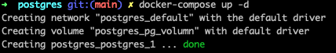
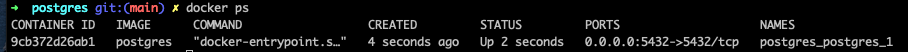

# workshop-pre-backend

## Setup

### Docker

- [Install Document](https://docs.google.com/document/d/1iI4a5dwhXkZ9AkrgiLWCN_fv3v25nlMLnYBg5ZRwWhM)

### PostgreSQL

> Prerequisite: Need docker

#### PG Setup scripts

```sh
cd ./postgres
# run docker in `Detached mode` (Run containers in the background)
docker-compose up -d
```

#### PG Result



#### PG Verify script

```sh
# check containers
docker ps
```



### DBeaver

- [Install Document](https://docs.google.com/document/d/1tohD9kqVyh_S-UT_9bI5D6xPAhQRtn_aFWi7teb0iw4/edit)
